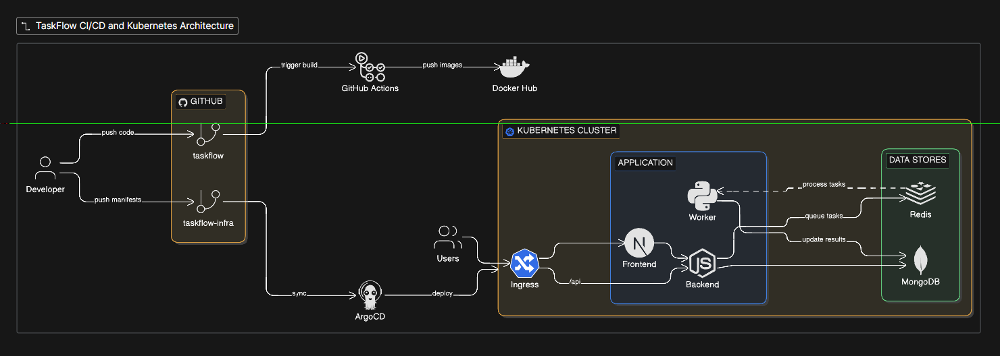

# TaskFlow

A modern full-stack task management application built with a microservices architecture. It includes Next.js for the frontend, Node.js/Express for the backend, and a Python worker for background tasks.

##  Architecture



- **Frontend**: Next.js (React), Tailwind CSS
- **Backend**: Node.js, Express, TypeScript, MongoDB
- **Worker**: Python, Redis (background processing)
- **Database**: MongoDB (Storage), Redis (Queue & Caching)

---

##  Getting Started

You can run this project in two ways: **Directly (Manual)** or using **Docker**.

### Method 1: Running with Docker (Recommended)

The easiest way to get everything running is using Docker. Ensure you have [Docker](https://docs.docker.com/get-docker/) and Docker Compose installed.

1. Clone the repository and navigate to the project directory:
   ```bash
   git clone https://github.com/Tanveer-rajpurohit/taskflow
   cd taskflow
   ```

2. Create a `.env` file in the root (or specific microservice directories as per your setup) and provide necessary environment variables (like MongoDB URI, Redis URL, JWT Secrets).

3. Start all services using Docker Compose:
   ```bash
   docker-compose up --build
   ```

4. The application services will be accessible at:
   - **Frontend**: http://localhost:3000
   - **Backend API**: http://localhost:5000

---

### Method 2: Running Directly (Manual Installation)

Require: Node.js (v18+), Python (v3.9+), MongoDB, and Redis running locally.

#### 1. Backend Setup
```bash
cd backend
npm install
npm run dev
```

#### 2. Frontend Setup
```bash
cd frontend
npm install
npm run dev
```

#### 3. Python Worker Setup
```bash
cd worker
python -m venv venv
# Windows
.\venv\Scripts\activate
# macOS/Linux
# source venv/bin/activate
pip install -r requirements.txt
python worker.py
```

